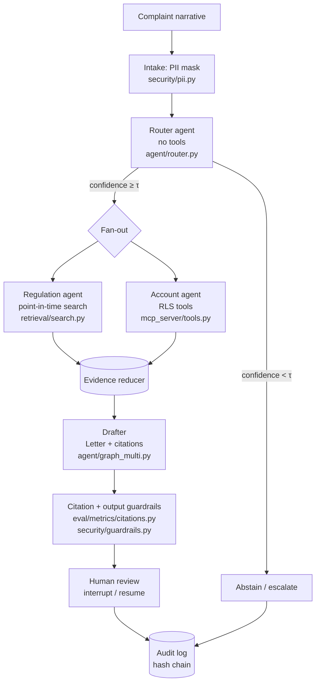
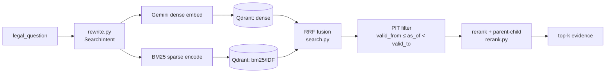
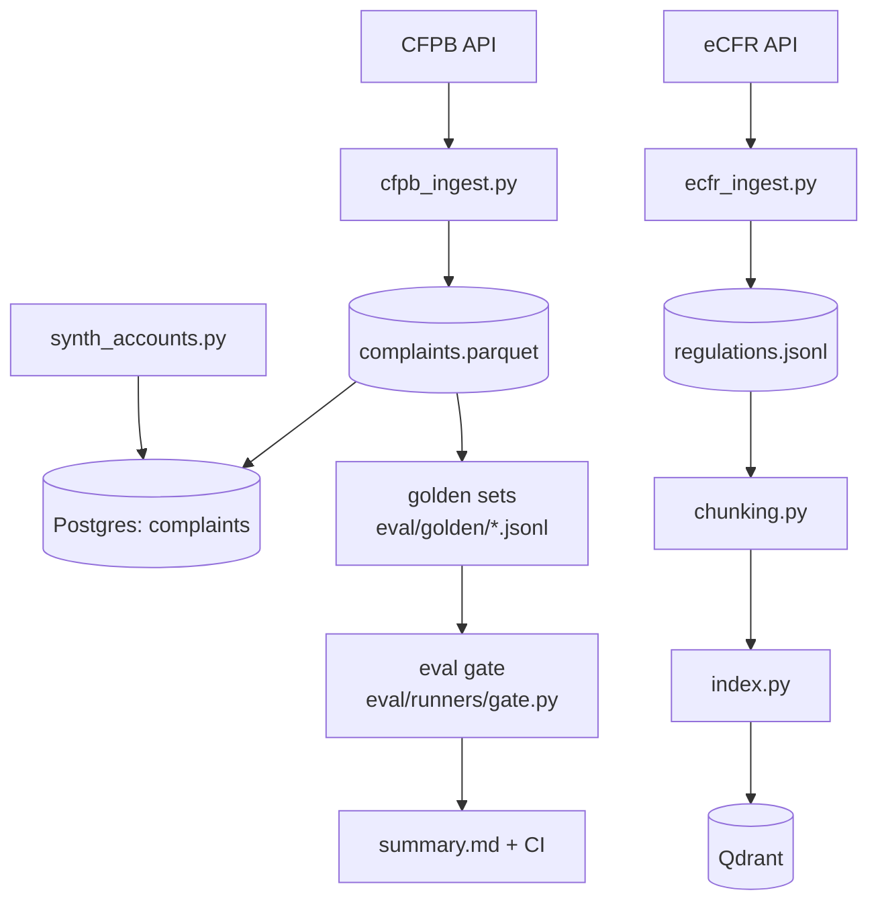
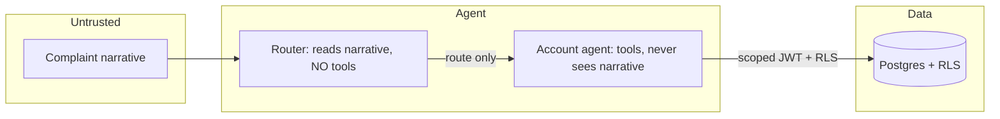

# RESOLVE — Architecture

Mermaid diagrams of the system, checked against the code (PLAN §11.6).

## Case flow (multi-agent graph)

## Retrieval (point-in-time hybrid)

## Data + eval pipeline

## Trust boundaries (security)

Rendered on GitHub automatically. Node labels name the implementing module.
